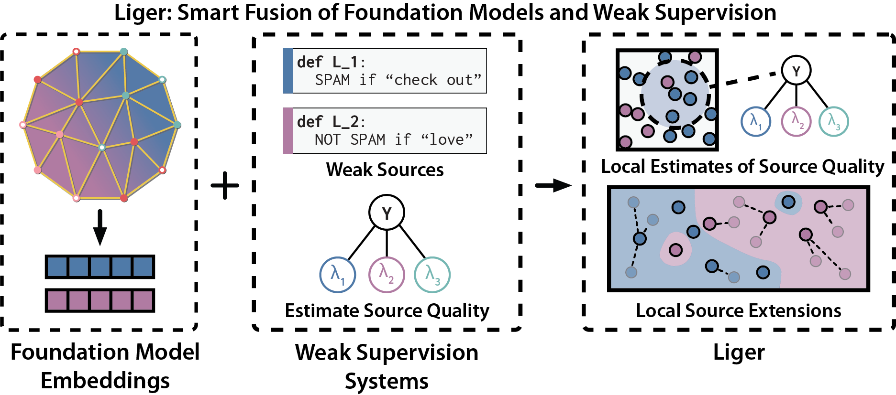

# Liger
This repository provides the official implementation of Liger from the
following paper:

**Shoring Up the Foundations: Fusing Model Embeddings and Weak Supervision**  
Mayee F. Chen*, Daniel Y. Fu*, Dyah Adila, Michael Zhang, Frederic Sala, Kayvon Fatahalian, Christopher Ré

Paper: https://arxiv.org/abs/2203.13270



## Installation

This repository depends on [FlyingSquid](https://github.com/HazyResearch/flyingsquid).
We recommend using `conda` to install FlyingSquid, and then you can install
Liger:
```
git clone https://github.com/HazyResearch/flyingsquid.git

cd flyingsquid

conda env create -f environment.yml
conda activate flyingsquid

pip install -e .

cd ..

git clone https://github.com/HazyResearch/liger.git

cd liger

pip install -e .
```

## Running Liger
1. Put the path to your pretrained embeddings in the respective dataset config file in [configs](https://github.com/HazyResearch/liger/tree/main/configs). We provide the pretrained embeddings for the spam dataset to run our examples. If the directory of the L and Y matrices is different from the embeddings, put the path in the `data_path` field in yaml (refer to [tennis.yaml](https://github.com/HazyResearch/liger/blob/main/configs/tennis.yaml)).

2. We provide [notebook example](https://github.com/HazyResearch/liger/blob/main/liger_example.ipynb) that you can directly run. We also provide a [python script](https://github.com/HazyResearch/liger/blob/main/run_liger.py) that you can run with the following command:
```
python run_liger.py -c configs/spam.yaml
```
To run for other datasets, change `configs/spam.yaml` to the dataset config instead.

3. You can run the python script and notebook for other datasets, but you need to put the pretrained embeddings path (and data path) in the config file. If you want to add more datasets, you can add you own dataset config.

